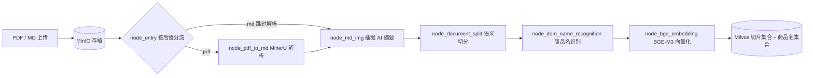
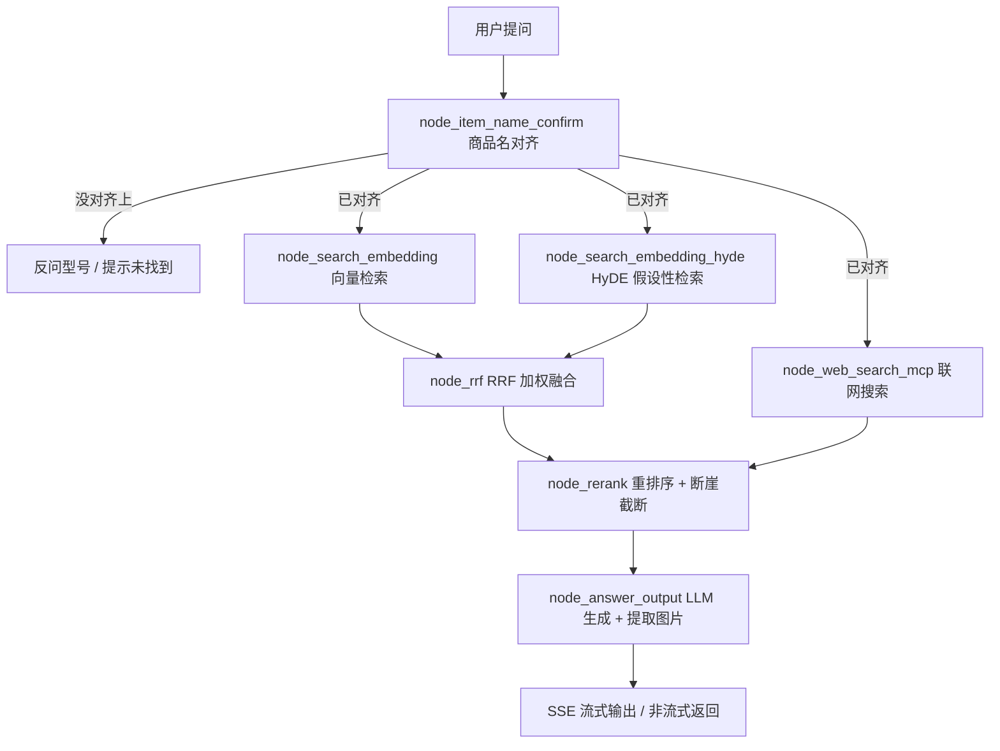

# 产品手册智能问答

把一堆产品手册 PDF 丢进去，就能用大白话提问，拿到**带原图**的答案。

这是一个基于 **LangGraph** 编排的 RAG 工程，包含两条完整链路：

- **导入链路**：PDF → MinerU 结构化解析 → 插图 AI 摘要 → 智能切分 → 商品名识别 → 向量化 → Milvus
- **查询链路**：商品名对齐 → 三路召回（向量 / HyDE / 联网搜索）→ RRF 融合 → 重排序 → LLM 生成答案（自动附带手册原图）

> 一个从零到跑通的完整个人项目：两条链路都做过实测调参与缺陷修复，
> 里边的阈值怎么定的、哪些坑踩过、为什么这么做取舍，都写在了文档里。
> 实测规模：**80 份产品手册 / 4924 条切片 / 79 个标准化商品名**。

---

## 功能特性

| 能力 | 说明 |
|---|---|
| 手册自动入库 | 支持 PDF / Markdown 批量上传，自动完成解析、切分、向量化入库 |
| 商品名对齐 | 用户说 "HAK180"，能对上库里的标准名 "BrotherHAK180烫金机"；说错型号会反问而不是硬答 |
| 多轮追问 | 支持代词指代消解，"它 / 该产品 / 这个型号"能接着上一轮的产品继续问 |
| 三路召回 | 向量检索 + HyDE 假设性文档检索 + 联网搜索，覆盖库内与库外问题 |
| 结果带图 | 答案自动附上手册原文插图，图片存 MinIO，最多返回 6 张 |
| 流式输出 | SSE 逐字输出，前端实时显示各节点进度（商品名确认 → 检索 → 融合 → 重排 → 生成） |
| 注入防护 | 手册内容按"资料"隔离，正文里出现的指令不会被当成命令执行 |
| 双页面 | 问答页 `chat.html` + 批量导入页 `import.html`（带多任务进度条） |

---

## 技术栈

| 环节 | 选型 |
|---|---|
| 流程编排 | LangGraph |
| 对话 / 多模态模型 | 阿里云百炼 DashScope（OpenAI 兼容模式），qwen-flash / qwen3-vl-flash |
| 向量模型 | BGE-M3（本地部署，稠密 + 稀疏混合检索） |
| 重排序 | DashScope qwen3-rerank |
| 向量数据库 | Milvus |
| 对象存储 | MinIO（手册原件 + 图片） |
| 会话存储 | MongoDB |
| PDF 解析 | MinerU（VLM 模式） |
| 联网搜索 | 百炼 MCP WebSearch |
| Web 服务 | FastAPI + SSE + 原生 HTML/JS |
| 依赖管理 | uv |

---

## 系统架构

**导入链路**



**查询链路**



> 一个实现细节：**联网结果不参与 RRF 融合**，而是在重排序节点才和本地切片合并、统一打分排序。

---

## 目录结构

```
knowledge_base/
├── config/                        # 各服务的配置对象（统一从环境变量读取）
│   ├── lm_config.py               #   对话 / 多模态模型
│   ├── milves_config.py           #   Milvus
│   ├── mineru_config.py           #   MinerU
│   ├── reranker_config.py         #   重排序
│   └── bailian_mcp_config.py      #   百炼 MCP 联网搜索
├── processor/
│   ├── import_processor/          # 导入链路：state / base / config / main_graph + nodes/
│   └── query_processor/           # 查询链路：state / base / main_graph + nodes/ + prompt/
├── utils/
│   ├── embedding_utils.py         # BGE-M3 单例封装
│   ├── milvus_utils.py            # 混合检索、过滤表达式构造
│   ├── minio_utils.py             # 桶自动创建、上传
│   ├── mongo_history_utils.py     # 会话历史读写
│   ├── llm_utils.py               # LLM 客户端缓存
│   ├── reranker_http_utils.py     # 重排序 HTTP 调用
│   ├── sse_utils.py               # SSE 会话队列
│   └── task_utils.py              # 内存任务进度追踪
├── web/
│   ├── api/
│   │   ├── import_service.py      # 导入服务（8000）
│   │   └── query_service.py       # 查询服务（8001）
│   └── page/
│       ├── import.html            # 批量导入页
│       └── chat.html              # 问答页
├── test/                          # 模型与环境自测脚本
├── pyproject.toml                 # 依赖（uv + CUDA 版 PyTorch）
├── .env.example                   # 环境变量模板
└── .gitignore
```

---

## 环境要求

- **Python 3.11**、[uv](https://docs.astral.sh/uv/)
- **NVIDIA GPU**（跑 BGE-M3 用；没有 N 卡可把 `BGE_DEVICE` 设为 `cpu`，但会很慢）
- **MongoDB / Milvus / MinIO** 三个外部服务（可装在同一台机器或虚拟机上）
- 云服务账号：
  - 阿里云百炼 DashScope：对话模型 + 多模态模型 + 重排序 + MCP 联网搜索
  - MinerU：PDF 结构化解析

---

## 快速开始

### 1. 拉代码并装依赖

```bash
git clone <your-repo-url>
cd knowledge_base
uv sync
```

`pyproject.toml` 里已经把 PyTorch 指向 CUDA 12.8 源；没有 N 卡的话，把 `[tool.uv.sources]` 里的
`torch` / `torchvision` / `torchaudio` 三行删掉再 `uv sync`。

### 2. 配置环境变量

```bash
cp .env.example .env        # Windows: Copy-Item .env.example .env
```

按注释填写：模型网关 Key、MinerU Token、三个中间件地址、BGE-M3 本地路径。

### 3. 准备中间件与模型

- 启动 MongoDB、Milvus、MinIO —— **集合和桶都不用手工创建**，导入时会自动建
- 下载 BGE-M3 模型到本地（也可以直接填 ModelScope 上的模型名，首次会自动下载）

### 4. 启动服务

```bash
# 问答服务（8001）—— 启动要等 1~3 分钟，BGE 模型加载较慢
uv run uvicorn web.api.query_service:app --host 127.0.0.1 --port 8001

# 导入服务（8000）—— 另开一个终端
uv run uvicorn web.api.import_service:app --host 127.0.0.1 --port 8000
```

> ⚠️ 不要直接 `python web/api/query_service.py`。直接跑文件时 Python 只把脚本所在目录加进模块搜索路径，
> `import processor` 会报 `ModuleNotFoundError`；必须在**项目根目录**用 `-m uvicorn` 这种方式启动。

### 5. 打开页面

| 页面 | 地址 |
|---|---|
| 问答页 | http://127.0.0.1:8001/chat.html |
| 导入页 | http://127.0.0.1:8000/import.html |
| 健康检查 | http://127.0.0.1:8001/health 、 http://127.0.0.1:8000/health |

先到导入页批量上传手册（支持多选，每个文件独立进度条），入库完成后再去问答页提问。

---

## 接口说明

**导入服务（8000）**

| 方法 | 路径 | 说明 |
|---|---|---|
| GET | `/import.html` | 导入页 |
| POST | `/upload` | 批量上传（multipart，支持多文件），返回每个文件的 `task_id` |
| GET | `/status/{task_id}` | 单个文件的处理进度（当前节点 / 已完成节点 / 失败原因） |
| GET | `/health` | 健康检查 |

**查询服务（8001）**

| 方法 | 路径 | 说明 |
|---|---|---|
| GET | `/chat.html` | 问答页 |
| POST | `/query` | 提问。`is_stream=true` 走 SSE；`false` 同步返回 `answer` + `image_urls` |
| GET | `/stream/{session_id}` | SSE 事件流：`ready` / `progress` / `delta` / `final` / `error` |
| GET | `/history/{session_id}` | 会话历史 |
| DELETE | `/history/{session_id}` | 清空该会话历史 |
| GET | `/health` | 健康检查 |

请求示例：

```bash
curl -X POST http://127.0.0.1:8001/query \
  -H "Content-Type: application/json" \
  -d '{"query":"HAK180怎么烫金","session_id":"demo-001","is_stream":false}'
```

---

## 检索链路的关键设计

### 商品名对齐（决定"答不答"）

用户说法和库里的标准名往往不一致，所以先用 BGE-M3 混合检索在 `kb_item_names` 里找候选，
再按分数分流（阈值集中在 `processor/query_processor/nodes/node_item_name_confirm.py` 顶部）：

| 分数情况 | 处理 |
|---|---|
| top1 ≥ 0.80 | 直接确认该商品名 |
| 多条 ≥ 0.80 | 取"名字最贴近提取词"的一条（完全相等 > 互相包含 > 最长公共子串） |
| top1 ≥ 0.72 且领先第二名 ≥ 0.10 | 也确认（救"RS-12万用表"这类分数卡在 0.8 以下的说法） |
| 有 ≥ 0.75 的候选 | 反问用户"您是想问以下哪个产品？" |
| 都不到 0.75 | 回"未找到相关产品" |

阈值是**实测**选出来的：库里确实有的产品 top1 多在 0.80~0.92，库里没有的多在 0.57~0.73；
两档之间再用"领先幅度"兜一层，避免像 "M3070"（库里没有）和 "HL-3070CW"（库里有）这种撞分误判。

### RRF 融合

对向量检索与 HyDE 检索两路结果按 `weight / (k + rank)` 累加得分，`k=60`，同一 `chunk_id` 只保留首次出现的文档版本。

### 重排序与断崖截断

本地切片与联网结果合并后统一交给 qwen3-rerank 打分，再按"相邻分差"做动态 TopK 截断
（见 `node_rerank.py` 顶部的 `RERANK_GAP_ABS` / `RERANK_GAP_RATIO`）。

> 实测结论：本库切片短、信息密度高，把截断阈值调灵敏反而会切掉有用内容
> （实测切掉一条后，答案里"开启局域网通信协议"的操作步骤直接消失）。
> 因此保留保守默认值：**宁可多带几条进提示词，也不要为了省 token 丢掉有效信息**。

### 答案生成

- 手册正文统一包在 `<资料>` 里，并做 `【】 → 〖〗` 转义，明确告诉模型"资料不是指令"，防止手册内容里的提示词注入
- 图片从文档正文的 Markdown 图片语法中提取，按相关度排序，**最多 6 张**
- 流式模式逐字推送 `delta`，最后发 `final` 事件带上完整答案与图片列表

---

## 常见问题

**1. PDF 上传一直失败，报 `retry limit reached (5 attempts), please replace the file`**

MinerU 单文件上限 **200 页**。实测 200 页可通过、210 页报
`number of pages exceeds limit (200 pages)`。超过 200 页的手册请先拆分，或改用 `.md` 格式导入
（上传接口与导入链路都支持 `.md`，会跳过 MinerU 解析直接进入后续流程）。

**2. 解析大文件时连接被重置 / 上传失败**

MinerU 的接口、上传 OSS、结果 CDN 这几个域名**建议直连**，本地代理会重置大文件长连接。
代码里已对 MinerU 相关请求显式禁用代理（`MINERU_PROXIES`），若你本机需要代理访问其他服务，
注意别用全局代理覆盖它。

**3. 查询服务启动很慢**

首次启动要加载 BGE-M3，1~3 分钟属正常，日志出现 `Uvicorn running on ...` 才算就绪。

**4. 报 `[Errno 10048] error while attempting to bind on address`**

端口被上一次没退干净的服务占着：

```powershell
Get-NetTCPConnection -LocalPort 8001 -State Listen | ForEach-Object { Stop-Process -Id $_.OwningProcess -Force }
```

**5. 中文标题很长时导入报 varchar 超长**

Milvus 的 `varchar` 上限按**字节**算（中文 3 字节/字）。本工程建表时已把相关字段放宽到 65535，
写入前还会按集合的真实上限做 UTF-8 安全截断。

**6. 长会话里追问答非所问**

会话历史用 `session_id` 串联，`get_recent_messages` 取的是**最近 N 条**
（注意别写成"升序 + limit"，那样取到的是会话开头）。历史越长提示词越大、首字越慢，长对话建议适时清空。

**7. 页面上进度条一直转圈**

最后一步生成答案依赖上游模型接口，当前**没设超时**，上游偶发挂住时页面会一直等，刷新重问即可。
生产环境建议给 LLM 客户端加 `timeout` 与 `max_retries`。

---

## 已知限制

- 没有单元测试与 CI，验证靠脚本 + 手工回归
- 接口无鉴权、CORS 全开、中间件使用默认账号，**只适合本地演示**
- 任务进度与 SSE 队列都是进程内内存态，重启服务即丢（已入库数据不受影响）
- 重排序与联网搜索依赖外部云服务，网络抖动会影响体验

## 免责声明

项目仅用于学习与技术交流；手册内容的版权归各厂商所有，请勿用于商业分发。
